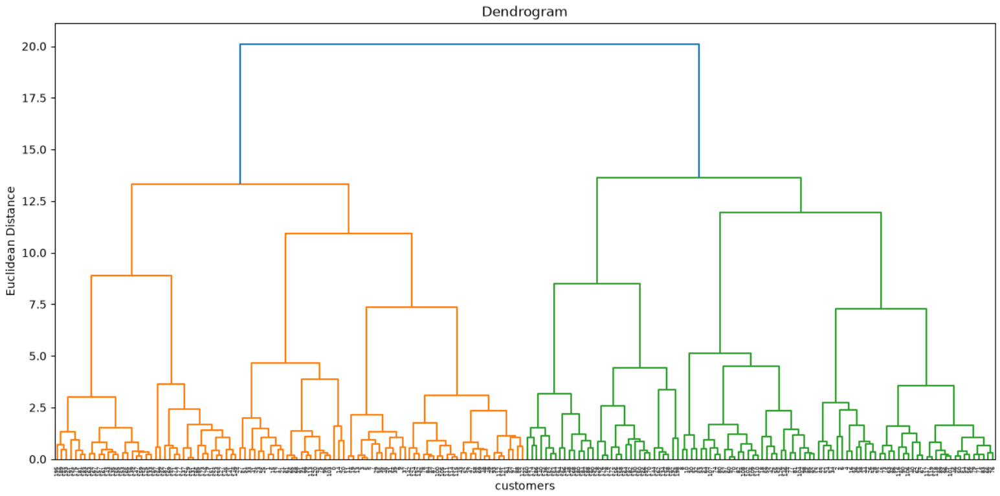
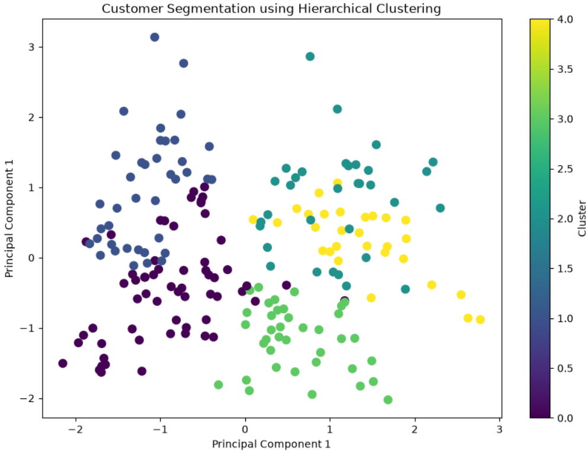

# Customer Segmentation using Hierarchical Clustering

## Project Overview

This project demonstrates customer segmentation using **Hierarchical Clustering (Agglomerative Clustering)** on the Mall Customer Segmentation dataset.

The objective is to group customers with similar purchasing behavior based on their demographic and spending characteristics. Unlike K-Means, Hierarchical Clustering builds a hierarchy of clusters and uses a **Dendrogram** to determine the optimal number of clusters.

The project also includes data preprocessing, feature scaling, dimensionality reduction using PCA, cluster visualization, customer profiling, and business insights.

---

## Dataset

**Dataset:** Mall Customer Segmentation Dataset

### Features

- CustomerID
- Gender
- Age
- Annual Income (k$)
- Spending Score (1-100)

---

## Technologies Used

- Python
- Jupyter Notebook
- Pandas
- NumPy
- Matplotlib
- Seaborn
- Scikit-learn
- SciPy

---

## Machine Learning Concepts Covered

- Unsupervised Learning
- Hierarchical Clustering
- Agglomerative Clustering
- Ward Linkage
- Euclidean Distance
- Dendrogram Analysis
- Feature Scaling
- Label Encoding
- Principal Component Analysis (PCA)
- Customer Segmentation

---

## Project Workflow

1. Load Dataset
2. Exploratory Data Analysis (EDA)
3. Data Cleaning
4. Label Encoding
5. Feature Scaling using StandardScaler
6. Dendrogram Generation
7. Agglomerative Hierarchical Clustering
8. PCA for Cluster Visualization
9. Customer Cluster Profiling
10. Business Insights

---

## Results

The model successfully segmented customers into **five meaningful clusters** based on Age, Annual Income, and Spending Score.

Each cluster represents customers with similar purchasing behavior, allowing businesses to:

- Identify premium customers
- Target high-income low-spending customers
- Improve customer retention
- Design personalized marketing campaigns
- Support business decision-making

---

## Project Structure

```text
Hierarchical_Clustering/
│
├── Customer_Segmentation_Hierarchical.ipynb
├── Mall_Customers.csv
├── Images/
│   ├── Dendrogram.png
│   ├── Hierarchical_Clusters.png
│   └── Cluster_Profile.png
└── README.md
```

---

## Dendrogram

The dendrogram helps determine the optimal number of clusters by visualizing how observations are merged based on their similarity.



---

## Customer Segmentation

The following visualization shows the customer groups formed using Hierarchical Clustering after applying PCA for dimensionality reduction.



---

The average values of Age, Annual Income, and Spending Score were calculated for each cluster to understand customer characteristics.


## Key Learnings

During this project, I learned:

- How Hierarchical Clustering groups similar observations.
- The difference between Agglomerative and Divisive Clustering.
- How to interpret a Dendrogram.
- How Ward Linkage minimizes within-cluster variance.
- The importance of feature scaling for distance-based algorithms.
- How PCA helps visualize high-dimensional data.
- How to generate business insights from customer segments.

---

## Skills Demonstrated

- Python Programming
- Data Preprocessing
- Exploratory Data Analysis
- Label Encoding
- Feature Scaling
- Hierarchical Clustering
- Dendrogram Analysis
- PCA
- Customer Segmentation
- Cluster Profiling
- Business Insight Generation
- Data Visualization

---

## Future Improvements

- Compare Hierarchical Clustering with K-Means and DBSCAN.
- Perform Hyperparameter Analysis using different linkage methods.
- Evaluate clustering performance using:
  - Silhouette Score
  - Davies-Bouldin Index
  - Calinski-Harabasz Score

---

## Author

**Anuj Bhatt**

Aspiring Machine Learning Enthusiast.